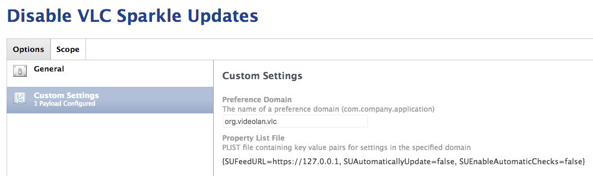

# 

Generates configuration profiles to set Sparkle-updater-enabled apps off by default. Inspired by Ben Toms [post on the Sparkle fiasco](https://macmule.com/2016/01/31/sparkle-updater-framework-http-man-in-the-middle-vulnerability/), [Nate Walck's Chef-driven version](https://github.com/natewalck/ChefExamples2016/blob/master/cookbooks/disablesparkle/recipes/default.rb), and [Greg Neagle's profiles](https://github.com/gregneagle/profiles/tree/master/autoupdate_disablers). Some sample profiles I generated with the tool can be found in the 'example output' folder.

### Usage
Download from releases, unpack, and use it on the command line in any of these three ways:

- `~/Downloads/Extinguish-v.3/extinguish.py /Applications/VLC.app`

By dragging the path to any affected app into the terminal window, this will generate a single profile in the root of your home folder (or whatever the current directory is you're working in) called `disable_autoupdates_VLC.app`.

- `~/Downloads/Extinguish-v.3/extinguish.py -a com.mactrackerapp.Mactracker -a com.fluidapp.Fluid`

This will generate two separate profiles with naming like the VLC example above.

- `~/Downloads/Extinguish-v.3/extinguish.py -g True -a com.mactrackerapp.Mactracker -a com.fluidapp.Fluid`

This will generate a single profile called `disable_all_sparkle_autoupdates.mobileconfig` containing payloads which will disable all apps specified in one shot.

*Note*, it's a little naïve about naming the resulting file(s) based on the last section in the bundle identifier, and bundle ID's with spaces in them need to be quoted.

To sign the profiles (if you're crazy like me and care about those things...) you can use https://github.com/nmcspadden/ProfileSigner.

#### NOTICE - **You still need to test the effectiveness of the profiles created!** In many cases, this _will not be enough_!
Please see a tool like Tim Sutton's [mcxToProfile](https://github.com/timsutton/mcxToProfile) and follow the workflow that tool provides to collect the appropriate keys for an app that does not work with Extinguish out-of-the-box, or edit the profile generated on your own.

_Thanks to @homebysix for the icon!_

### Create a PLIST for Use with JSS / JAMF

If you want to be able to push profiles made through Extinguish into your JSS rather than install them manually or package them up, you'll need to create a .plist.

If you plan on combining preferences for multiple applications, you'll need to create a .plist for each app.  You can then combine those PLISTs into a single configuration profile on your JSS.

01. Create your Extinguish .mobileconfig file.
02. Open Terminal and read the contents of the .mobileconfig file:

- `cat /path/to/profile.mobileconfig`

03. Note the `<key>` text directly below the `<key>PayloadContent</key>`

_Example - VLC_
```
<key>PayloadContent</key>
<dict>
    <key>org.videolan.vlc</key>
```

04. With a program like BBEdit, Sublime, or other editor, create a new file with the following basic PLIST data:
```
<?xml version="1.0" encoding="UTF-8"?>
<!DOCTYPE plist PUBLIC "-//Apple//DTD PLIST 1.0//EN" "http://www.apple.com/DTDs/PropertyList-1.0.dtd">
<plist version="1.0">
<dict>

</dict>
</plist>
```

05. Insert the key/value pairs for each preference from the .mobileconfig file below the `<key>mcx_preference_setting</key>` in between `<dict></dict>` in your PLIST file:

_Example - VLC_
```
<key>mcx_preference_setting</key>
<dict>
    <key>SUAutomaticallyUpdate</key>
    <false/>
    <key>SUEnableAutomaticChecks</key>
    <false/>
    <key>SUFeedURL</key>
    <string>https://127.0.0.1</string>
</dict>
```

06. The final PLIST should look something like the following:
```
<?xml version="1.0" encoding="UTF-8"?>
<!DOCTYPE plist PUBLIC "-//Apple//DTD PLIST 1.0//EN" "http://www.apple.com/DTDs/PropertyList-1.0.dtd">
<plist version="1.0">
<dict>
    <key>SUAutomaticallyUpdate</key>
    <false/>
    <key>SUEnableAutomaticChecks</key>
    <false/>
    <key>SUFeedURL</key>
    <string>https://127.0.0.1</string>
</dict>
</plist>
```

07. Save your PLIST file with the name you found below the `<key>PayloadContent</key>` from step 3 followed by a .plist

_Example - VLC_
* org.videolan.vlc.plist

08. Now you have a PLIST file with the necessary preferences to disable Sparkle updates.  Upload your PLIST(s) to a JSS configuration profile using the Custom Settings payload and test it!


